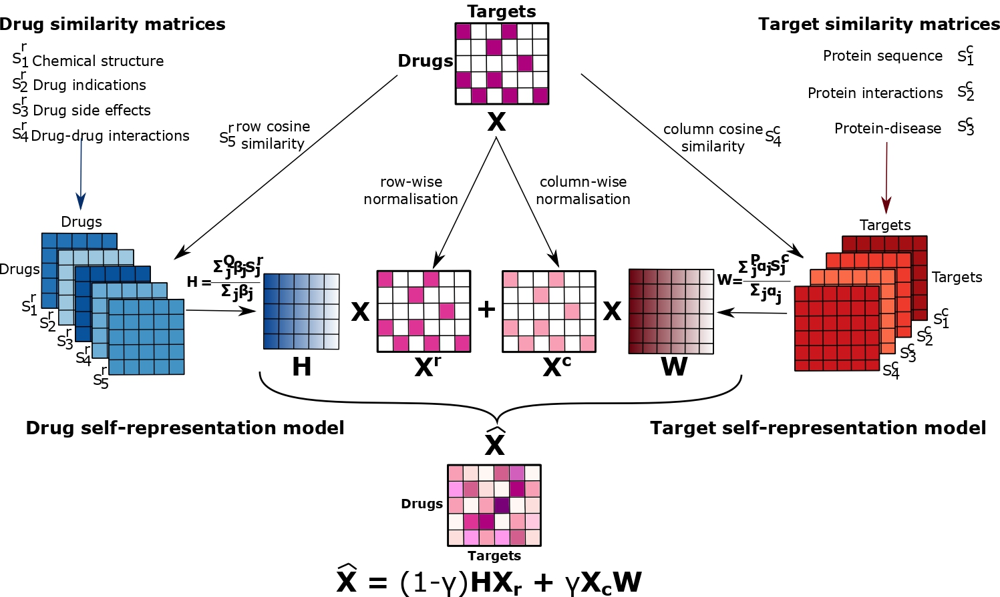

# LI-DTI: A linear interpretable model for Drug Target Prediction

Official implementation of LI-DTI, a Linear Interpretable Drug-Target Interaction prediction model inspired by recommender systems.
LI-DTI learns from drug-drug and target-target similarity matrices –-chemical, biological, and pharmacological-– and provides interpretable predictions as a linear combination of these interactions.

# LI-DTI

  

# Requeriments
- MATLAB (R2018a or later recommended).
- Toolboxes: Statistics and Machine Learning and Optimization.

# Code and Data

## Data Files
All data files are available here: https://zenodo.org/records/18262393. 

- `data/luo_dataset/`: Data used for prediction tasks on the DTINet dataset.
- `repository/`: Replicable predictions for each model under warm- and cold-start settings.
- `prospective_evaluation/`: Data used for the prospective evaluation on DrugBank.

## Code
This section describes the code used to run LI-DTI.

### Warm- and Cold-Start Scenarios

#### Warm-Start Scenario
1. Run `warm_start_10_CV_predictions.mlx` to generate predictions.
2. Run `plot_warm_start.mlx` to produce evaluation results.
3. Run `removing_similarities_warm_start_true_CV.mlx` to evaluate performance after removing similar instances.

#### Drug Cold-Start Scenario
1. Run `drug_cold_10_cv.mlx` to generate predictions.
2. Run `plot_10CV_drug_cold_start_all_metrics.mlx` to produce evaluation results.

#### Target Cold-Start Scenario
1. Run `target_cold_10_cv.mlx` to generate predictions.
2. Run `plot_10CV_target_cold_start_all_metrics.mlx` to produce evaluation results.

All predictions are saved in the `./repository/` folder.

### Prospective Evaluation
1. Run `prospective_2022_compute_allSI.mlx` to generate predictions saved in `./repository/prospective_evaluation/`.
2. For drug-wise recall, run `corrections_of_prospective_2022_drugswise.mlx`.
3. For target-wise recall, run `corrections_of_prospective_2022_targetwise.mlx`.

   
# Web Tool 
Web tool to search for drugs and targets and generate sunburst plots that explain predicted scores available here: https://paccanarolab.org/exdtiweb/.

# Contacts
If you have any questions or comments, please feel free to contact:
- **Santiago Ferreyra** (`santiago.ferreyra@fgv.br`).

