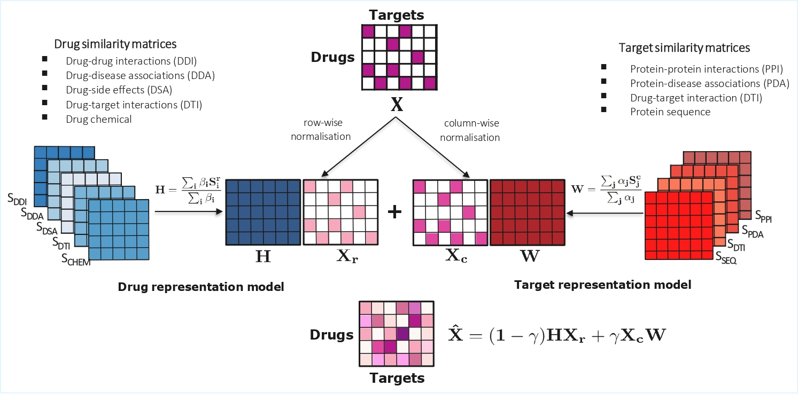
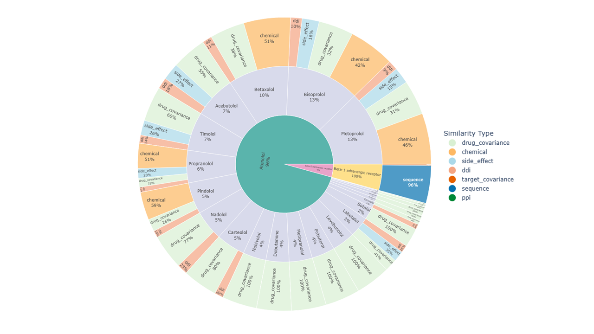

# LI-DTI: A linear interpretable model for Drug Target Prediction

Official implementation of LI-DTI, a Linear Interpretable Drug-Target Interaction prediction model inspired by recommender systems.
LI-DTI learns from drug-drug and target-target similarity matrices –-chemical, biological, and pharmacological-– and provides interpretable predictions as a linear combination of these interactions.

# LI-DTI
<p align="center">
  
</p>

# Requeriments
- MATLAB (R2018a or later recommended).
- Toolboxes: Statistics and Machine Learning, and Optimization.

The code was originally developed in Matlab and has been revised to run also in GNU Octave without requiring a Matlab license.
- GNU Octave version: X.X.X
- Operating system: Windows 10/11
- Required Octave packages: 

Instructions for running the code below.

# Code and Data

## Data Files
All data files are available here: https://zenodo.org/records/18262393. 

- `data/luo_dataset/`: Data used for prediction tasks on the DTINet dataset. Each evaluation scenario (e.g., `warm_start_10_CVs`, `drug_cold_start`, `target_cold_start`) is organized into 10 cross-validation splits (`cv_1`–`cv_10`). Within each `cv_i` folder, the data are further divided into paired training and test matrices, corresponding to the folds used in the 10-fold cross-validation procedure.
- `prospective_evaluation/`: Data used for the prospective evaluation on DrugBank.
- `repository/`: Replicable predictions for each model under warm- and cold-start settings and prospective evaluation.

The top-level structure is organized as follows:
```text
LI-DTI/ 
├── data/                          # Contains all datasets used in all the scenarios.
│   ├── luo_dataset/
│   │   ├── drug_cold_start/
│   │   ├── target_cold_start/
│   │   ├── warm_start_10_CVs/
│   │   └── similarities/
├── prospective_evaluation/        # Contains data for prospective/realistic for the prospective evalaution.
├── repository/                    # Contains all the prediction for each competitors in the different experiments. 
│   ├── cold_start_evaluation_1/
│       ├── drug_cold_start/
│       └── target_cold_start/
│   ├── prospective_evaluation/                
│   └── warm_start_10_CVs/        
└── README.md 
```
- `code/` directory need to be at the top level inside of the LI-DTI/.

## Code
This section describes the code used to run LI-DTI.

### Warm- and Cold-Start Scenarios

#### Warm-Start Scenario 
1. Run `warm_start_10_CV_predictions.mlx` to generate predictions.
2. Run `plot_warm_start.mlx` to produce evaluation results (calculate and plot AUC and AUPR (mean,std) for predictions).
3. Run `removing_similarities_warm_start_true_CV.mlx` to evaluate performance after removing similar instances.
 
#### Drug Cold-Start Scenario 
1. Run `drug_cold_10_cv.mlx` to generate predictions.
2. Run `plot_10CV_drug_cold_start_all_metrics.mlx` to produce evaluation results.

#### Target Cold-Start Scenario 
1. Run `target_cold_10_cv.mlx` to generate predictions.
2. Run `plot_10CV_target_cold_start_all_metrics.mlx` to produce evaluation results.

All predictions are saved in the `./repository/` folder.

### Prospective Evaluation
1. Run `prospective_2022_compute_allSI.mlx` to generate predictions saved in `./repository/prospective_evaluation/`.
2. For drug-wise recall, run `corrections_of_prospective_2022_drugswise.mlx`.
3. For target-wise recall, run `corrections_of_prospective_2022_targetwise.mlx`.

Numerical values for LI-DTI and competing methods are provided in `./results/` folder (and Supplementary Tables).
   
# Web Tool 
Web tool to search for drugs and targets and generate sunburst plots that explain predicted scores available here: https://paccanarolab.org/lidtiweb/.

<p align="center">
  
</p>

Example of DTI prediction: beta-blocker Atenolol and the target ADRB2. 

# Contacts
If you have any questions or comments, please feel free to contact:
- **Santiago Ferreyra** (`santiago.ferreyra@fgv.br`).

